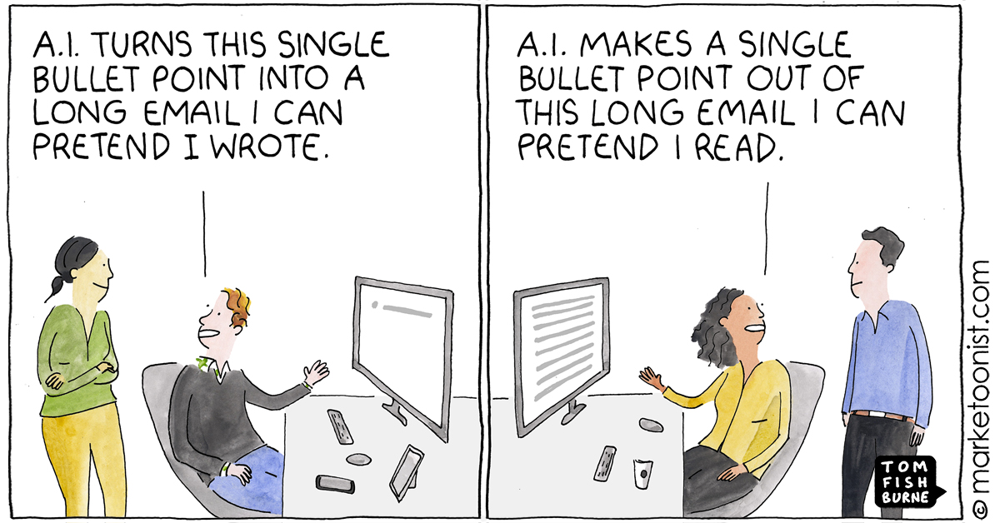

# Syllabus + Outline

<!-- START doctoc generated TOC please keep comment here to allow auto update -->
<!-- DON'T EDIT THIS SECTION, INSTEAD RE-RUN doctoc TO UPDATE -->

- [Syllabus + Outline](#syllabus--outline)
  - [Schedule](#schedule)
  - [Important Links](#important-links)
  - [Communication](#communication)
    - [Feedback](#feedback)
    - [Use of AI](#use-of-ai)
  - [Grading](#grading)
    - [Attendance - (12pts) 10%](#attendance---12pts-10)
    - [Participation - (12pts) 10%](#participation---12pts-10)
    - [Assignments - (24pts) 20%](#assignments---24pts-20)
      - [Assignment 1 - Responsive Design (8pt) September 27th, 2024](#assignment-1---responsive-design-8pt-september-27th-2024)
      - [Assignment 2 - Iteration Speed (8pt) October 22nd, 2024](#assignment-2---iteration-speed-8pt-october-22nd-2024)
      - [Assignment 3 - Security (8pt) December 13th, 2024](#assignment-3---security-8pt-december-13th-2024)
    - [Check-ins - (72pts) 60%](#check-ins---72pts-60)
      - [Check-in 1 (October 11th, 2024)](#check-in-1-october-11th-2024)
      - [Check-in 2 (December 18th, 2024)](#check-in-2-december-18th-2024)
  - [Honor Code](#honor-code)
  - [Preventing \& Responding to Sexual Misconduct](#preventing--responding-to-sexual-misconduct)
  - [Student Disability](#student-disability)

<!-- END doctoc generated TOC please keep comment here to allow auto update -->

## Schedule

| Date                                | Subject                                  |
| ----------------------------------- | ---------------------------------------- |
| September 4th, 2024                 | High Level Overview and Task Management  |
| September 11th, 2024                | Frontend, Prototyping and Responsiveness |
| September 18th, 2024                | Guest Lecture - Tanner Linsely           |
| September 25th, 2024                | Q&A + Tech Talks                         |
| October 2nd, 2024                   | Backend and Databases                    |
| October 9th, 2024                   | Authentication                           |
| October 16th, 2024                  | Testing                                  |
| October 23rd, 2024                  | Guest Lecture - Jared Yarn               |
| October 30th, 2024                  | Q&A + Tech Talks                         |
| November 6th, 2024                  | CI / CD, Staging Environments            |
| November 13th, 2024                 | Guest Lecture                            |
| November 20th, 2024                 | Q&A + Tech Talks                         |
| November 25th - November 29th, 2024 | No Office Hours                          |
| December 4th, 2024                  | Security                                 |
| December 11th, 2024                 | Retrospective                            |
| December 18th, 2024                 | Last Day for Late Work / Check-Ins       |

## Important Links

- Lecture notes: https://github.com/hhenrichsen/sandbox-2024-lecture-notes
- Office Hours: https://calendly.com/hhenrichsen
- Contact Email: hunter.henrichsen@byu.edu

## Communication

The real world runs on communication. You can't skip meetings or miss deadlines
without letting the interested parties know. I expect the same out of you – talk
to me, let me know what adjustments or accommodations you need as they arise.
I'll be as flexible as I can be with deadlines as long as you talk to me in
advance. Afterwards, I feel the need to do those who were on time justice by
adding a penalty to those who are late.

I'm available via email and Slack for this class. I get notifications from Slack
more frequently than email.

### Feedback

I am still fairly new to teaching (it's not my first rodeo because it's my
second), and I want this class to be as useful to you as possible. To that end,
if you have feedback for me, whether that's something you want me to adjust,
start doing, or stop doing, please let me know, either by one of the above
communication channels or via
[this anonymous form](https://docs.google.com/forms/d/e/1FAIpQLSdcu-u0LD5kB9rhOcA7E1ZCw6w05RlejzrFrRALEz7krkLjVQ/viewform?usp=sf_link).

### Use of AI

Please do not use AI to communicate with me. AI normally results in much more
verbose communication, and I prefer to get straight to the point. I have worked
enough with AI that I can generally tell, and I worry about situations like this
becoming more and more common:

## Grading

### Attendance - (12pts) 10%

1pt per day of class, with two free absences. Tracked on learning suite.

Make this up by sending me 2-3 interesting articles about the subject and
completing the reading for that day of class, then emailing me a brief summary
of how you have applied that to your current project.

### Participation - (12pts) 10%

Here are some options for participation:

- Give a Tech Talk (12 points)
- Ask questions in class (4 points)
- Talk about news at the beginning of class (4 points)
- Come in for office hours outside of check-ins (3 points)
- Submit topics to the Q&A sessions (2 points)
- Submit the participation activity in each class session (1 point)

This is available all semester, so there is no makeup for this assignment. This
is easier to do during class than out of it.

### Assignments - (24pts) 20%

Assignments can be turned in late for half credit. If you are concerned about
the deadline / have other sandbox-related things going on, please let me know
beforehand and we can figure out an equivalent or more individualized deadline.

If you think you've done something equivalent already, reach out and let's talk
about it. I'd rather you focus on building, and give you credit where it's due.

#### Assignment 1 - Responsive Design (8pt) September 27th, 2024

**Option 1** Build a simple blog site that does the following:

- Has a header with links to an archive of posts, top posts, and a page about
  the author. These links do not need to work or go to different pages. (1
  point)
- Has a listing of posts (at least 3) for the main body of the content that
  follows good readability rules and responds to changes in screen size well. (2
  points)
- Each post should have a published date, an author, an estimated reading time,
  a title, a preview of the content, a banner image, and a like count. More
  prominent and important elements should be emphasized. (1 point)
- Has a footer that lists the copyright year. (1 point)
- Responds to dark and light mode. (1 point)

The site can be entirely static. Push this to a private GitHub repo. Share the
repo with `hhenrichsen`. Submit the link to the repo to this assignment. Using
CSS libraries is not required, but may make this easier for you.

**Option 2** Submit 3 deployed pages in your app that you have audited for
responsive design, including the following rules:

- Text and image content follow good readability and contrast rules, and respond
  to common screen sizes. (3 points)
- Headers and footers respond well to screen sizes, including 32:9 and 9:16
  aspect ratios. (3 points)
- Responds to dark and light mode. (2 points)

Submit a deployed link to these pages.

In either option, you may submit an additional feature that boosts the user
experience for an additional 4 points.

#### Assignment 2 - Iteration Speed (8pt) October 22nd, 2024

Record a video of (come in during office hours and show me, or share your code
with me with a brief explanation of) two features you've developed or are
otherwise using to iterate quickly. Some ideas include:

- Hot Module Reloading
- Developer Tools / Scripts (beyond just starting, testing, and / or stopping
  the server)
- Branch Deployments

Up to 3 features may be submitted for 4 points each.

#### Assignment 3 - Security (8pt) December 13th, 2024

This assignment should be done individually.

Complete the Basic (4/11 points each) and Javascript (4/7 points each) tracks on
HackThisSite (4 points each). There are multiple challenges in each track. When
they are completed, they will turn blue, like this:

![[Pasted image 20240902230240.png]]

Submit a link to your profile on the site, and add a comment mentioning Sandbox
2024 or SB04 to your profile.

Additional tracks are optional, but can be completed for 4 points each in the
assignments category.

### Check-ins - (72pts) 60%

#### Check-in 1 (October 11th, 2024)

There are two options for this. With the other engineers on your team, make an
appointment during office hours, or submit a recording at your leisure. Either
way, we'll talk about these things:

- What are you currently working on building?
- What technical problems are you currently working towards solving (i.e., have
  started planning or writing code for, not just discussed at one point)?
- What tech stack are you using? Why did you choose it?

**Point Breakdown:**

- 12pts - Answering the Initial Questions
- 12pts - Demonstrating Progress Towards a Production Application
- 8pts - Answering Follow-up Questions

#### Check-in 2 (December 18th, 2024)

There are two options for this as well. With the other engineers on your team,
make an appointment during office hours, or submit a recording at your leisure.
Either way, we'll talk about these things:

- What have you built? Show off some key features of your final project, and any
  demos of ideas that didn't work out.
- What problems have you solved?
- What tools or processes have you found useful?
- What do you want to hear about next semester?

**Point Breakdown:**

- 12pts - Answering the Initial Questions
- 12pts - Demonstrating Progress Towards a Production Application
- 8pts - Answering Follow-up Questions

## Honor Code

In keeping with the principles of the BYU Honor Code, students are expected to
be honest in all of their academic work. Academic honesty means, most
fundamentally, that any work you present as your own must in fact be your own
work and not that of another. Violations of this principle may result in a
failing grade in the course and additional disciplinary action by the
university. Students are also expected to adhere to the Dress and Grooming
Standards. Adherence demonstrates respect for yourself and others and ensures an
effective learning and working environment. It is the university's expectation,
and every instructor's expectation in class, that each student will abide by all
Honor Code standards. Please call the Honor Code Office at 422-2847 if you have
questions about those standards.

## Preventing & Responding to Sexual Misconduct

_The health and well-being of students is of paramount importance at Brigham
Young University.  If you or someone you know has experienced sexual harassment
(including sexual violence), there are many resources available for assistance._

In accordance with Title IX of the Education Amendments of 1972, BYU prohibits
unlawful sex discrimination, including sexual harassment, against any
participant in its education programs or activities. The university also
prohibits sexual harassment by its personnel and students. Sexual harassment
occurs when

- a person is subjected to unwelcome sexual speech or conduct so severe,
  pervasive, and offensive that it effectively denies their ability to access
  any BYU education program or activity;
- any aid, benefit, or service of BYU is conditioned on a person’s participation
  in unwelcome sexual conduct; or
- a person suffers sexual assault, dating violence, domestic violence, or
  stalking on the basis of sex.

University policy requires all faculty members to promptly report incidents of
sexual harassment that come to their attention in any way, including through
face-to-face conversations, a written class assignment or paper, class
discussion, email, text, or social media post. Incidents of sexual harassment
should be reported to the Title IX Coordinator
at [t9coordinator@byu.edu](mailto:t9coordinator@byu.edu) or (801) 422-8692 or
1085 WSC. Reports may also be submitted online
at [https://titleix.byu.edu/report](https://titleix.byu.edu/report) or
1-888-238-1062 (24-hours a day).

BYU offers confidential resources for those affected by sexual harassment,
including the university’s Sexual Assault Survivor Advocate, as well as a number
of non-confidential resources and services that may be helpful. Additional
information about Title IX, the
university’s [Sexual Harassment Policy](https://policy.byu.edu/view/index.php?p=155&s=s879),
reporting requirements, and resources can be found
at [http://titleix.byu.edu](http://titleix.byu.edu/) or by contacting the
university’s Title IX Coordinator.

## Student Disability

Brigham Young University is committed to providing a working and learning
atmosphere that reasonably accommodates qualified persons with disabilities. A
disability is a physical or mental impairment that substantially limits one or
more major life activities. Whether an impairment is substantially limiting
depends on its nature and severity, its duration or expected duration, and its
permanent or expected permanent or long-term impact. Examples include vision or
hearing impairments, physical disabilities, chronic illnesses, emotional
disorders (e.g., depression, anxiety), learning disorders, and attention
disorders (e.g., ADHD). If you have a disability which impairs your ability to
complete this course successfully, please contact the University Accessibility
Center (UAC), 2170 WSC or 801-422-2767 to request a reasonable accommodation.
The UAC can also assess students for learning, attention, and emotional
concerns. If you feel you have been unlawfully discriminated against on the
basis of disability, please contact the Equal Opportunity Office at
801-422-5895, [eo_manager@byu.edu](mailto:eo_manager@byu.edu), or
visit [https://hrs.byu.edu/equal-opportunity](https://hrs.byu.edu/equal-opportunity) for
help.”
